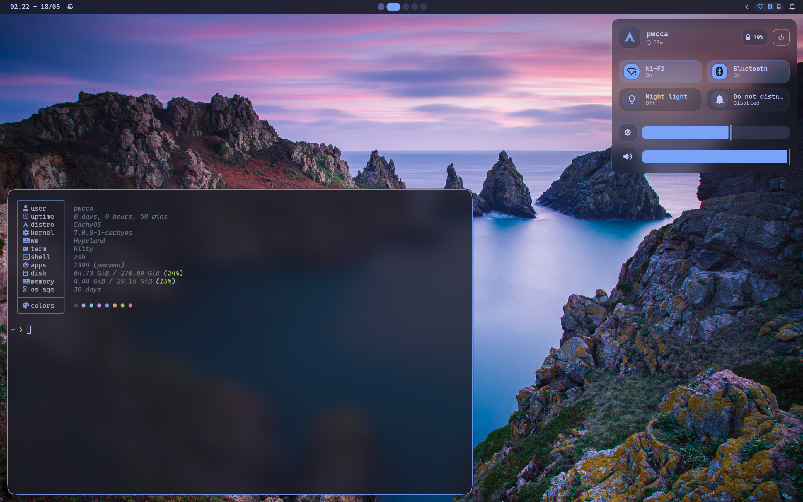

# Dotfiles

> Arch Linux dotfiles managed with [GNU Stow](https://www.gnu.org/software/stow/), featuring a Hyprland (Wayland) desktop environment with a custom QuickShell bar and a fixed Tokyo Night appearance.

This repo is originally based on [lyne-dots](https://github.com/caioax/lyne-dots), then heavily modified for personal use.

---

## 📸 Screenshots

### Tokyo Night



## ✨ Features

- 🪟 **Hyprland** - Floating-first Wayland compositor with desktop-like workflow
- 🖥️ **QuickShell** - Custom QML-based status bar, launcher, notifications, quick settings, and power menu
- 🎨 **Tokyo Night** - One fixed dark theme shared by QuickShell, Kitty, Neovim, Hyprland, GTK, and Qt
- 🖼️ **Wallpaper Picker** - Built-in wallpaper manager with search and favorites
- 📸 **Screenshot Tool** - Multi-monitor region/fullscreen capture with annotation overlay
- ✏️ **Neovim** - Lua-based configuration with LSP, Telescope, Smart Splits, and lazy.nvim
- 📟 **Tmux** - Terminal multiplexer with seamless Neovim navigation (Smart Splits)
- 🐱 **Kitty** - GPU-accelerated terminal configured for Tokyo Night
- ⚡ **Zsh** - Oh-My-Zsh with autosuggestions, syntax highlighting, vi-mode, and Powerlevel10k
- 🔧 **CLI** - Built-in command-line tool for managing the dotfiles

### 🎨 Theme

Tokyo Night is the only configured theme. Its colors are defined statically for:

| Component                                 | What changes                                |
| ----------------------------------------- | ------------------------------------------- |
| QuickShell (bar, launcher, notifications) | All UI colors                               |
| Kitty                                     | Terminal colors, cursor, tabs, borders      |
| Neovim                                    | Tokyo Night colorscheme                     |
| Hyprland                                  | Active/inactive border colors, shadow       |
| GTK / Qt                                  | Application theme colors                    |
| Wallpaper                                 | Independent wallpaper selection via awww     |

Theme switching, light variants, and Material You color generation are intentionally removed.

---

## 📦 Installation

### Requirements

- Arch Linux
- Git
- Internet connection

### Steps

```bash
git clone <repo-url> ~/.pwcca-dots
cd ~/.pwcca-dots
./install.sh
```

The installer is interactive and lets you pick which package categories to install. After finishing, it will prompt you to reboot.

| Category     | Packages                           |
| ------------ | ---------------------------------- |
| `core`       | Hyprland, UWSM, portal             |
| `terminal`   | Kitty, Zsh, Tmux, Fastfetch        |
| `editor`     | Neovim + development tools         |
| `apps`       | Dolphin, Zen Browser, Spotify, mpv |
| `utils`      | Clipboard, playerctl, audio, etc   |
| `fonts`      | Nerd Fonts, cursors, icons         |
| `quickshell` | QuickShell bar/shell               |
| `theming`    | Static Qt/GTK Tokyo Night appearance |
| `nvidia`     | NVIDIA drivers (only if needed)    |

### Advanced Options

```bash
./install.sh --stow-only       # Only create symlinks
./install.sh --setup-only      # Only run Hyprland setup
./install.sh --packages core   # Install a single category
```

See [.install/README.md](.install/README.md) for more details.

---

## 🔧 CLI

This setup includes a built-in CLI tool called `pwcca` for managing the dotfiles. It is loaded automatically via `.zshrc`.

### Usage

```
pwcca <command> [args...]
```

### Commands

| Command   | Description                                         |
| --------- | --------------------------------------------------- |
| `state`   | Manage `state.json` (edit, sync, rebuild)           |
| `migrate` | Manage migrations (run, list, done)                 |
| `update`  | Pull latest changes, sync state, and run migrations |
| `git`     | Run git commands in the dotfiles repo               |
| `reload`  | Reload QuickShell                                   |
| `help`    | Show available commands                             |

Run `pwcca <command> --help` for details and subcommands.

### Examples

```bash
# Pull the latest changes and apply migrations
pwcca update

# Check the git status of the dotfiles
pwcca git status

# Edit the QuickShell state configuration
pwcca state

# Sync state.json after a manual defaults.json update
pwcca state sync

# Check which migrations are pending
pwcca migrate list

# Show help for a specific command
pwcca state --help
```

---

## ⌨️ Keybindings

### Apps

| Keybind          | Action                 |
| ---------------- | ---------------------- |
| `Super + Return` | Terminal (Kitty)       |
| `Super + Shift + F` | File Manager (Dolphin) |
| `Super + Shift + Z` | Browser (Zen Browser)  |
| `Super + Shift + C` | VSCode                 |
| `Super + Space`  | App Launcher           |

### Windows

| Keybind                   | Action                          |
| ------------------------- | ------------------------------- |
| `Super + W`               | Close focused window            |
| `Super + F`               | Fullscreen                      |
| `Super + Shift + Space`   | Toggle floating / tiled         |
| `Super + Tab`             | Next window                     |
| `Alt + Tab`               | Next window                     |
| `Alt + Shift + Tab`       | Previous window                 |
| `Super + H J K L`         | Move focus (left/down/up/right) |
| `Super + Shift + H J K L` | Move window                     |
| `Super + Alt + H J K L`   | Resize window                   |
| `Super + Left Click`      | Drag window                     |
| `Super + Right Click`     | Resize window                   |

### Workspaces

| Keybind                        | Action                               |
| ------------------------------ | ------------------------------------ |
| `Super + 1-0`                  | Switch to workspace 1-10             |
| `Super + Shift + 1-0`          | Move window to workspace 1-10        |

### System

| Keybind             | Action            |
| ------------------- | ----------------- |
| `Super + B`         | Wallpaper Picker  |
| `Super + /`         | Keybinds Help     |
| `Super + V`         | Clipboard History |
| `Super + Escape`    | Power Menu        |
| `Print`             | Screenshot        |
| `Super + Shift + R` | Reload QuickShell |

### Media

| Keybind           | Action                         |
| ----------------- | ------------------------------ |
| `Volume Keys`     | Volume up / down / mute        |
| `Brightness Keys` | Brightness up / down           |
| `Media Keys`      | Play / Pause / Next / Previous |

---

## 📁 Structure

Each top-level directory is a [GNU Stow](https://www.gnu.org/software/stow/) package that gets symlinked into `$HOME`.

| Directory     | Description                                                                          |
| ------------- | ------------------------------------------------------------------------------------ |
| `hyprland/`   | Hyprland compositor config (appearance, keybinds, rules)                             |
| `quickshell/` | QML shell: bar, launcher, notifications, quick settings                              |
| `nvim/`       | Neovim config with lazy.nvim plugin manager                                          |
| `tmux/`       | Tmux config with TPM and Smart Splits integration                                    |
| `kitty/`      | Kitty terminal config with Tokyo Night colors                                        |
| `zsh/`        | Zsh config with Oh-My-Zsh and Powerlevel10k                                          |
| `local/`      | Custom scripts and wallpapers (`~/.local/wallpapers/`)                              |
| `fastfetch/`  | System info display config                                                           |
| `theming/`    | Static GTK3/4 and Qt5/6 Tokyo Night settings                                         |
| `kde/`        | KDE Plasma global settings (colors, icons, fonts)                                    |

### Other Directories

| Directory          | Description                                           |
| ------------------ | ----------------------------------------------------- |
| `.install/`        | Installation scripts and package lists                |
| `.data/`           | Templates, Tokyo Night palette, and default wallpapers |
| `.data/pwcca-cli/` | CLI commands, libraries, and migrations               |

---

## 🛠️ Tech Stack

| Component       | Tool            |
| --------------- | --------------- |
| Compositor      | Hyprland        |
| Session Manager | UWSM            |
| Desktop Shell   | QuickShell      |
| Terminal        | Kitty           |
| Shell           | Zsh + Oh-My-Zsh |
| Multiplexer     | Tmux            |
| Editor          | Neovim          |
| Wallpaper       | awww            |
| File Manager    | Dolphin         |
| Browser         | Zen Browser     |
| AUR Helper      | paru            |
| Dotfile Manager | GNU Stow        |

---

## ⚙️ Customization

Machine-specific configs are kept in `~/.config/hypr/local/` and are not tracked by git. The install script generates these from templates in `.data/hyprland/templates/` on first run:

- `monitors.lua` - Monitor layout
- `workspaces.lua` - Workspace mapping
- `extra_environment.lua` - Local environment variables
- `autostart.lua` - Local autostart programs
- `extra_keybinds.lua` - Local keybinds

### Wallpapers

Wallpapers live in `~/.local/wallpapers/` (git-ignored, defaults copied on install) and are managed through the QuickShell wallpaper picker (`Super + B`). Features include:

- **Search** by filename
- **Favorites** with persistent state

---

## 🙏 Credits

- Original dotfiles foundation from [caioax/lyne-dots](https://github.com/caioax/lyne-dots)
- Screenshot implementation inspired by [HyprQuickFrame](https://github.com/Ronin-CK/HyprQuickFrame)
